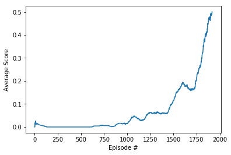

# Project 3:  Tennis Collaboration and Competition
Author: Amit Kumar Verma

## Introduction
The project demonstrates the ability of multi agent policy gradients actor-critic methods, specifically, [Multi Agent Deep Deterministic Policy Gradients](https://arxiv.org/pdf/1706.02275.pdf). 

Let's first introduce the theory and methods important for MADDPG. I will build up from basic policy gradients, to actor-critic methods, to deep deterministic policy gradients (DDPG), to Multi Agent Deep Deterministic Policy Gradients (MADDPG).

### Policy Gradients

Policy gradient methods learn to directly mapping observed states to actions that maximize return. Advantages over value function methods include continuous action spaces, learning stochastic policies, and stability of convergence. Disadvantages include potential for getting stuck in a local optima, poor sample efficiency, and slow convergence.

A neural network function approximator can represent a policy by taking in state values and outputting actions over a continuous range. The agent can learn a parameterized policy $\pi_\theta(a|s)$ for the probability of action $a$ given state $s$ by optimizing parameter $\theta$, where the objective function $J(\theta)$ is the expected return. The environmental dynamics are unknown, so the agent samples returns from the environment to estimate the expected value. Furthermore, the objective of expected return is also the previously mentioned state value $v^\pi(s)$, which can be expressed as the probability-weighted sum of action values.

$$
\begin{align}
& J(\theta) = \mathbb{E}_\pi \left[R_t|s_t=s\right] \\
& J(\theta) = v^\pi(s) \\
& J(\theta) = \sum_{a \in \mathcal{A}} \pi_\theta (a|s) q^\pi(s,a)
\end{align}
$$

Gradient ascent can maximize the objective function $J(\theta)$ by iteratively updating parameters $\theta$ at a learning rate $\alpha$ in the direction of the gradient $\nabla_\theta J(\theta)$:

$$ \theta_{t+1} \leftarrow \theta_t + \alpha \nabla_\theta J(\theta_t) $$

The gradient $\nabla_\theta J(\theta_t) = \nabla_\theta \big[\sum_{a \in \mathcal{A}} \pi_\theta (a|s) q^\pi(s,a) \big]$ initially appears challenging to obtain. The product rule requires taking the gradient on both the policy $\pi_\theta(a|s)$ term (straightforward) and action value $q^\pi(s,a)$ term (challenging). 
The gradient of the action value function $\nabla_\theta q^\pi(s,a)$ requires knowing how the parameters $\theta$ affect the state distribution, since $q^\pi(s,a) = \sum_{s',r} p(s',r \mid s,a) [r + \gamma v^\pi(s')]$ includes the transition function. Luckily, the policy gradient theorem [3] provides an expression for $\nabla_{\theta} J(\theta)$ that doesn't require the derivative of the state distribution $d^\pi(s)$.

$$
\nabla_{\theta} J(\theta) \propto \sum_{s \in \mathcal{S}} d^\pi(s) \sum_{a \in \mathcal{A}} q^\pi(s,a) \nabla_\theta \pi_\theta(a|s) 
$$

Since following policy $\pi$ results in the appropriate state distribution, we can express the summation over state distribution as the expected value under policy $\pi$ by sampling $s_t \sim \pi$. This form suits our stochastic gradient ascent approach for updating parameters $\theta$ by allowing us to sample the expectation of the gradient as the agent interacts with the environment.

$$
\nabla_{\theta} J(\theta) = \mathbb{E}_\pi \left[ \sum_{a \in \mathcal{A}} q^\pi(s_t,a) \nabla_\theta \pi_\theta(a|s_t) \right]
$$

We can multiply and divide by $\pi_\theta(a|s_t)$ to replace the summation over actions with an expectation under policy $\pi$, sampling $a_t \sim \pi$. Furthermore, we can express the action value function by its definition as the expected discounted return $\mathbb{E}_\pi \left[ R_t \mid s_t, a_t \right]$.

$$
\begin{align}
&\nabla_{\theta} J(\theta) = \mathbb{E}_\pi \left[ \sum_{a \in \mathcal{A}} \pi_\theta(a|s_t) q^\pi(s,a) \frac{\nabla_\theta \pi_\theta(a|s_t)}{\pi_\theta(a|s_t)} \right] \\
&\nabla_{\theta} J(\theta) = \mathbb{E}_\pi \left[ q^\pi(s_t,a_t) \frac{\nabla_\theta \pi_\theta(a_t|s_t)}{\pi_\theta(a_t|s_t)} \right] \\
&\nabla_{\theta} J(\theta) = \mathbb{E}_\pi \left[ R_t \frac{\nabla_\theta \pi_\theta(a_t|s_t)}{\pi_\theta(a_t|s_t)} \right] \\
&\nabla_{\theta} J(\theta) = \mathbb{E}_\pi \left[ R_t \nabla_\theta \log \pi_\theta(a_t|s_t) \right] 
\end{align}
$$

The update for parameters $\theta$ becomes proportional to the return $R_t$, inversely proportional to the action probability $\pi_\theta$ (to counteract frequent actions), and in the direction of the gradient $\nabla_\theta \pi_\theta$. 

$$
\begin{align}
&\theta_{t+1} \leftarrow \theta_t +  \alpha R_t \frac{\nabla_\theta \pi_{\theta_t}(a_t|s_t)}{\pi_{\theta_t}(a_t|s_t)} \\
&\theta_{t+1} \leftarrow \theta_t + \alpha R_t \nabla_\theta \log \pi_{\theta_t}(a_t|s_t)  
\end{align}
$$

This basic policy gradient method is called REINFORCE. Using the Monte Carlo approach of sampling returns to estimate the gradient $\nabla_\theta J(\theta)$ is unbiased but has high variance, making it slow and not sample efficient. Subtracting a baseline from the return is one solution for reducing variance. If the chosen baseline does not vary with action, the expectation doesn't change and remains unbiased. The state value function makes for a good baseline.

We can approximate the true value function $v^\pi(s)$ with a neural network $V_\omega(s_t)$ parameterized by $\omega$, learned using stochastic gradient descent with the objective of minimizing the error $\frac{1}{N} \sum_i (R_t - V_\omega(s))^2$ across a mini-batch of $N$ samples. The value and policy parameters update together at their respective learning rates.

$$
\begin{align}
&\delta_t = R_t - V_\omega(s_t) \\
&\omega_{t+1} \leftarrow \omega_t + \alpha_\omega \delta_t \nabla_\omega V_\omega(s_t) \\
&\theta_{t+1} \leftarrow \theta_t + \alpha_\theta \delta_t \nabla_\theta \log \pi_\theta(a_t|s_t)
\end{align}
$$

### Actor-Critic

We can further utilize the value function to improve learning by reducing variance at the cost of introducing bias. Actor-critic methods use the value function to not merely provide a baseline. A "critic" provides a biased value estimate that replaces full sampled returns to guide the policy, which is the "actor". This approach bootstraps a value estimate using an estimate of the subsequent state value obtained with the same function approximator. Bootstrapping reduces variance to speed up learning, but introduces bias due to reliance on an imperfect critic model. 

For example, an actor-critic method can replace the sampled return $R_t$ with an estimate from the temporal-difference (TD) target $r_{t+1} + \gamma V_\omega(s_{t+1})$ using the critic. The network parameters for both the policy (actor) and the value function (critic) are updated with guidance from the critic.

$$
\begin{align}
&\delta_t = R_t - V_\omega(s_t) \\
&\delta_t = \left[ r_{t+1} + \gamma V_\omega(s_{t+1}) \right] - V_\omega(s_t) \\
&\omega_{t+1} \leftarrow \omega_t + \alpha_\omega \delta_t \nabla_\omega V_\omega(s_t) \\
&\theta_{t+1} \leftarrow \theta_t + \alpha_\theta \delta_t \nabla_\theta \log \pi_\theta(a_t|s_t)
\end{align}
$$

This approach doesn't require completing a full trajectory like Monte Carlo.

### Deep Deterministic Policy Gradients (DDPG)

The actor-critic framework allows us to combine policy gradients with a value-based method like DQN to extend it to continuous action spaces. The techniques introduced in DQN also help deal with issues of error and instability arising from using function approximators with reinforcement learning and policy gradients. 

DQN builds on Q-learning (Watkins, 1989), a classic off-policy TD algorithm. Q-learning updates tabular Q-values toward a TD target computed using the action $a = \text{argmax}_{a} Q(s',a)$ that maximizes the Q-value of the subsequent state.

$$
Q(s,a) \leftarrow Q(s,a) + \alpha [r + \gamma \max_a Q(s',a) - Q(s,a)]
$$

DQN extended Q-learning using deep neural network function approximators for greater representational capacity to handle high-dimensional state spaces. The DQN paper also introduced experience replay buffers and target networks to stabilize learning. 

DDPG (Lillicrap et al., 2016) combines DQN with policy gradient methods using the actor-critic framework to learn a deterministic policy $\mu_\theta(s)$ that acts to approximate Q-learning with guidance from a DQN-like critic $Q_\omega(s,a)$.

#### Multi Agent Deep Deterministic Policy Gradients (MADDPG)
Similar to the DDPG architecture, each agent has it’s own actor and critic network. The actor network takes in the current state of agent and output a recommended action for that agent. However the critic part is slightly different from the ordinary single-agent DDPG. Here the critic network of each agent has full visibility on the environment. It not only takes in the observation and action of that particular agent, but also observations and actions of all other agents as well. Critic network has much higher visibility on what is happening while actor network can only access to the observation information of the respective agent. The output of the critic network is, nevertheless, still the Q value estimated given a full observation input(all agents) and a full action input(all agents). The output of the actor network is a recommended action for that particular agent.

The critic network is active only training time. This network will be absent in testing time.

#### 3.2 Model Architecture
MADDPG uses four neural networks: 
1. A Q network ( Critic )
2. A deterministic policy network ( Actor ), 
3. A target Q network
4. A target policy network.

The Q network and policy network is very much like single-agent DDPG, but in Mult-agent DDPG, Multiple agents share the same buffer instead of having individual buffer per agent.

The main concept behind this algorithm is summarized in this illustration taken from the paper :

# Hyperparameters

| Hyperparameter        | DDPG       |
|-----------------------|------------|
| Replay buffer size    |  int(1e6)  |
| Batch size            |  252       |
| $\gamma$              |  0.99      |
| $\tau$                |  1e-3      |
| LR Actor              |  1e-4      |
| LR Critic             |  1e-3      |
| Number of episodes    |  3000      |

Note: some of hyperparameter are not mentioned here since they are network specific.

## Plot of Rewards
Plot showing the score per episode over all the episodes. The environment was solved in **1918** episodes.

## Ideas for Future Work
1. Hyperparameter Tuning
2. The [Twin Delayed DDPG (TD3)](https://spinningup.openai.com/en/latest/algorithms/td3.html) improves on MADDPG with three techniques for handling function approximation error: clipped double Q-learning, delayed policy update, and target policy smoothing. 

#### Clipped Double Q-learning

Q-learning is positively biased due to the max operation used for action selection. For example, taking the max over noisy variables that individually have zero mean can produce an output with positive mean. Double Q-learning (Van Hasselt et al., 2010) and Double DQN (Van Hasselt et al., 2016) deal with the overestimation by maintaining two separate value networks to decouple action selection and evaluation. 

Going beyond discrete action spaces, the TD3 paper demonstrates overestimation bias also occurs for continous action spaces in the actor-critic framework. Mitigating bias requires decoupling the action selection (policy) from evalution (value function). We therefore want to use the double Q-learning approach for updating value targets using independent critics.

$$
\begin{align}
&y_1 = r + \gamma Q_{\omega'_2}(s', \mu_{\theta_1}(s') ) \\
&y_2 = r + \gamma Q_{\omega'_1}(s', \mu_{\theta_2}(s') ) 
\end{align}
$$

However, positive bias still occur for actor-critics with double Q-learning because the critics are not completely independent due to related learning targets and a shared replay buffer. The TD3 paper introduced Clipped Double Q-learning, which uses the minimum of the two critics. The less biased critic becomes upper-bounded by the more biased critic.

$$
y_1 = r + \gamma \min_{i=1,2} Q_{\omega'_i}(s', \mu_{\theta_1}(s') )
$$

Clipped double Q-learning mitigates overestimation by favoring underestimation. This trade-off makes sense since underestimation bias aren't prone to spread across learning updates.

#### Delayed Policy Updates 

The TD3 paper highlights the interplay between value and policy updates. Poor value estimates can produce policy updates with divergent behavior. They suggest reducing the frequency of policy updates relative to value updates to allow time for value estimates to improve. This reduces the variance in value estimates used to update the policy, producing a better policy that feeds back into better value estimates. The concept is similar to freezing target networks to reduce error. I use a delay $d=2$ of two critic updates for every actor update as suggested by the TD3 paper.

The DDPG paper suggests a soft update hyperparameter $\tau=0.001$ while the TD3 paper uses $\tau=0.005$. Without delayed policy updates, I found $\tau=0.001$ more stable for the Reacher environment. Since the policy update delay also delays the target network updates, I scale $\tau = 0.001d$ in proportion to the delay $d$ to maintain a similar rate of change in the target networks.

#### Target Policy Smoothing

Deterministic policies can overfit narrow peaks in the value function, increasing variance in the TD target. The TD3 paper address the issue using a regularization technique. Since nearby actions should have similar values, adding some noise to the action in the TD target action evalution should help avoid peaks in the value function. 

$$
\begin{align}
&y = r + \gamma \min_{i=1,2} Q_{\omega'_i}(s', \mu_{\theta'}(s')+\epsilon ) \\
&\epsilon \sim \text{clip}(\mathcal{N}(0,\sigma), -c, c) 
\end{align}
$$

The TD3 paper suggests hyperparamaters of $\sigma=0.2$ clipped at $c=0.5$. For the Reacher environment, I found these settings slowed down learned. Perhaps the noise was too high relative to the action signal range. Scaling down the noise and even using none showed better performance.
